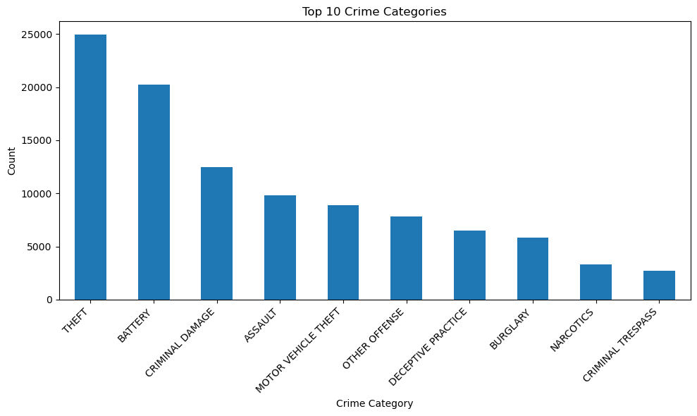
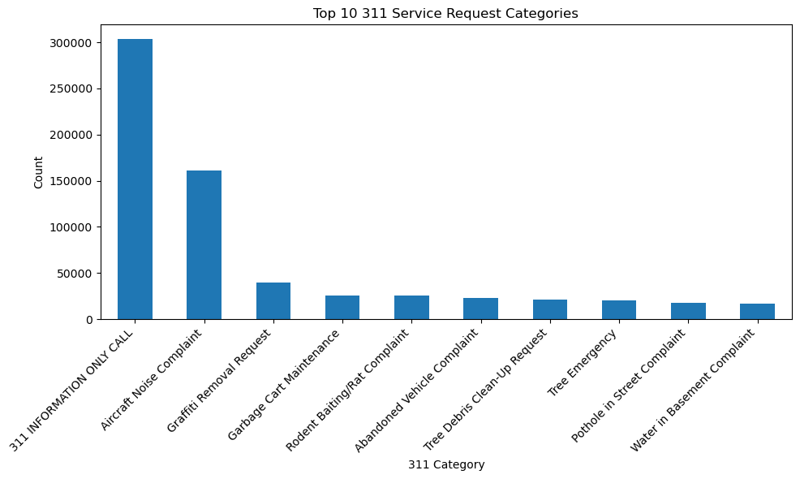
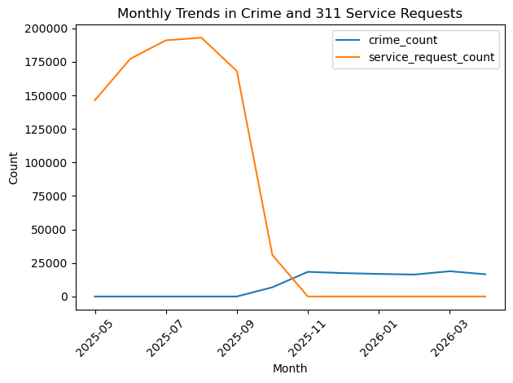

# Temporal Patterns and Relationships Between Crime and 311 Service Requests in Chicago
## Contributors
Avery Terri
* Data collection and acquisition
* Data profiling and documentation
* Data quality assessment
* Data cleaning and preprocessing
* Feature engineering
  
Sam Kowal
* Exploratory data analysis
* Correlation Analysis attempt and Limitation documentation
* Interpretation of results
* Report writing (findings & solutions)
* Visualizations and output tables

## Project Summary
The goal of this project is to analyze patterns in public safety and community service activity in Chicago using datasets from
the city of [Chicago Open Data Portal](https://data.cityofchicago.org/). Specifically, this project explores how reported crime incidents 
and 311 service requests* vary over time and whether there are observable relationships between different types of crime and types
of service requests. 

Understanding these relationships is important because both datasets reflect different aspects of urban life. Crime data captures
reported public safety incidents, while 311 service requests represent non-emergency concerns reported by residents, like infrastructure
issues or environmental concerns. By examining both, this project aims to identify patterns that may suggest connections between community
conditions and public safety trends. 

The **primary research questions** for this analysis are:
* Are there observable correlations between specific types of crime and specific 311 service requests?
* How do crime incidents and service requests vary over time (monthly)?

To address these questions, both datasets were cleaned, standardized, and transformed to enable comparison. Temporal features such as
year and month were extracted from time fields, and categorical variables were simplified to focus on the most relevant and frequent
categories. The datasets were then aggregated at the monthly level, allowing for consistent comparison and reducing noise present in daily
data. 

Preliminary analysis focused on identifying distributions of crime types and service request categories, as well as examining trends over time.
Correlation analysis was performed on aggregated monthly data to explore potential relationships between categories across datasets. 

Overall, this projects aims to provide insight into how patterns in public service requests and crime reports may be related, while also
highlighting the limitations of working with large, real-world urban datasets. 

## Storage and Organization

To support reproducibility and clarity, the project follows a structured design: 
```
data/
├── raw/             
│   ├── chicago_crime.csv
│   └── chicago_311.csv
├── processed/
│   ├── crime_clean.csv
│   └── 311_clean.csv    
             
outputs/
├── figures/         
├── tables/           

README.md
requirements.txt
```

Raw datasets are stored in data/raw and are never edited directly. All preprocessing steps are performed through scripts in the
scripts/ folder, and outputs are stored in the data/processed/ and outputs/ folder. This separation ensures transparency and allows
the entire workflow to be reproduced. 

## Data Description and Profiling
### Dataset #1: Chicago Crime Data
**Source:** [Chicago Open Data Portal](https://data.cityofchicago.org/)

* Search "Crime"
* Select *Crimes - 2001 to present*
* Filter for desired time frame (using 2025-2026 for this project)

**Acquisition:** 

Downloaded a CSV file and stored in data/raw/chicago_crime.csv

**Coverage:**

This dataset includes reported crime incidents in Chicago from 2001 to the present, with each row representing a single
incident. For this analysis, we will be using data from May 2025-May 2026. 

**Format:**

CSV (tabular)

**Variables Used:**

- **date:** Date when the incident occured. It's sometimes a best estimate. 
- **primary_type:** The primary description of the IUCR (Illinois Uniform Crime Reporting code) code

**Description:**

The dataset provides detailed records of reported crimes, allowing analysis of how different types of incidents vary over time.
Only temporal and categorical variables were used in this project to maintain focus on trends rather than spatial analysis. 

**Ethical Considerations:**

Although the dataset is anonymized, it represents real-world incidents. Additionally, it only includes reported crimes. Meaning that
the data may not fully refelct actual crime rates. 

____
### Dataset #2: Chicago 311 Service Requests
**Source:** [Chicago Open Data Portal](https://data.cityofchicago.org/)

* Search "311"
* Select *311 Service Requests*
* Filter for desired time frame (using 2025-2026 for this project)
  
**Acquisition:**

Downloaded a CSV file and stored in data/raw/chicago_311.csv

**Coverage:**

This dataset contains non-emergency service requests submitted by residents, including issues such as potholes, sanitation, and infrastructure
maintenance. For this analysis, we will be using data from May 2025-May 2026.

**Format:**

CSV (tabular)

**Variables:**

- **CREATED_DATE:** When the incident was reported.
- **SR_TYPE:** Description of the incident.

**Description:**

Each record represents a request submitted by a resident. The dataset reflects patterns in community concerns and engagement over time.

**Ethical Considerations:**

Data is anonymized and publicly available. However, it does reflect citizen reporting behavior, which may vary accross communities and introduce
bias. Areas with higher engagement may appear to have more issues simply due to increased reporting.

____
**Dataset Integration**

The datasets were integrated through temporal aggregation, using shared datetime fields. Both datasets were aligned at the monthly level, allowing comparison
of:
* Crime frequency by type
* Service request frequency by type

Because there is no shared unique identifier, integration was performed through aggregation rather than direct joins. 

## Data Quality Assessment

Data Quality was assessed through inspection and summary statistics during preprocessing. 

**Completeness**

Both datasets contained missing values, particularly in timestamp fields. Since temporal analysis is central to the project,
records with missing values were removed. Cateogrical variables were largely complete, though some contained ambiguous or missing labels.

**Consistency**

There were inconsistencies in column naming conventions and category labels accross datasets. Similar categories were sometimes
labeled differently, requiring standardization before analysis.

**Accuracy**

Some timestamp values were improperly formatted or invalid. These were identified during conversion to datetime format and removed when necessary.

**Class Imbalance**

A small number of categories dominated both datasets. For example, certain crime types and service request categories appeared much more
frequently than others. This imbalance made it difficult to analyze less common categories and influenced the decision to focus on the most
frequent types.

**Bias and Limitations**

Both datasets are subject to reporting bias:
* Crime data includes only reported incidents
* 311 data depends on citizen reporting behavior

Additionally, inconsistencies in reporting frequency and timing introduced variability in the data. Aggregating data at the monthly level helped reduce
noise and improve interpretability. 

## Data Cleaning

Data Cleaning was performed using Python scripts to ensure consistency and usability accross both datasets.

**Column Standardization:**

Column names were converted to lowercase and formatted consistently to allow easier processing and integration.

**Handling Missing Values:**

Rows with missing or invalid timestamps were removed, as they could not be used in temporal analysis. 
Missing categorical values were either removed or grouped where appropriate.

**Duplicate Removal:**

Duplicate records were removed to prevent double-counting and ensure accurate aggregation.

**Datetime Conversion:**

Timestamp fields were converted into a consistent datetime format. This step was essential
for extracting temporal features and aligning the datasets.

**Feature Engineering:**

New variables were created from timestamps, including:

* year
* month
* day of week

These features enabled aggregation and trend analysis.

**Category Standardization:**

Similar categories were grouped together to reduce redundancy and improve clarity. 
Less frequent categories were consolidated to focus the analysis on meaningful patterns.

**Filtering:**

Both datasets were filtered to include only the most frequent and relevant categories. 
This reduced noise and improved computational efficiency.

## Findings
This project analyzed patterns in Chicago crime data and 311 service request data to explore potential relationships between public safety incidents and community-reported service issues. The analysis focused on identifying the most common categories in each dataset, visualizing trends over time, and attempting to assess whether meaningful correlations exist between the two.
The analysis explored patterns in Chicago crime reports and 311 service requests using cleaned datasets aggregated by category and month. Exploratory data analysis was used to identify the most common categories in each dataset and compare monthly patterns over time.

The results show that theft is the most common crime category, with 24,939 reported incidents, the next most common were battery (20,215) and criminal damage (12,447). Other notable categories include assault, motor vehicle theft, and burglary. These findings show that property-related and interpersonal crimes dominate the dataset, which aligns with typical trends in urban environments. The relatively high counts for theft and battery indicate that these types of incidents occur consistently and at a large scale.

In contrast, the 311 service request data is heavily dominated by non-emergency and maintenance related issues. The most frequent category, “311 Information Only Call,” has 303,884 requests, which is significantly higher than any other category. The next most frequent categories are aircraft noise complaints (160,945), graffiti removal requests (40,187), and garbage cart maintenance (26,017). These results highlight that many 311 requests are informational or related to quality-of-life concerns rather than urgent infrastructure failures.

The visualizations further reinforce these differences. The bar charts clearly show the steep dropoff after the top categories in both datasets, especially for 311 requests, where the top category is far above all others. This shows a high level of concentration in certain types of service interactions.

The monthly trends analysis attempts to compare how crime and service requests change over time. However, the datasets only shared one overlapping month (October 2025). Since multiple shared time periods are needed for the correlation analysis, it was not possible to compute meaningful statistical relationships between the two datasets. This limitation prevented deeper analysis of whether increases in crime correspond to increases in service requests. Despite this limitation, the findings still provide useful insights. The comparison highlights how crime data reflects direct public safety concerns, while 311 data shows broader community needs and environmental issues. When used together, they offer a more complete picture of urban activity, even though a direct relationship between them could not be made in this analysis.

## Challenges
There were several challenges throughout this project. One major challenge was dealing with inconsistencies between the datasets and aligning the two datasets over time.. Although both the crime and 311 data relate to public activity in Chicago and were supposed to be compared, they did not fully cover the same months after cleaning. The 311 service request data covered May 2025 through October 2025, while the crime data mainly covered October 2025 through April 2026. This meant that only October 2025 appeared in both datasets. This lack of overlap limited the planned correlation analysis. Since correlation requires multiple shared time points, meaningful correlations between crime categories and 311 service request categories could not be calculated. Instead, the project focused on descriptive analysis, including the most common categories and monthly trends within each dataset.

Another challenge was with data preprocessing. Cleaning and preparing the datasets required ensuring that key variables, such as category labels and date formats, were consistent. Even small inconsistencies, such as differences in how months were formatted, could prevent proper grouping and aggregation. Ensuring that both datasets used comparable structures required careful attention and verification. This took up more time than initially planned.

The large size of the datasets was also challenging and made the project more complex. The crime and 311 datasets contain a lot of rows and categories, which is why they needed to be cut down to only include certain categories. Working with large real-world datasets that contained imbalanced categories proved to be difficult. A few categories appeared much more often than others, which made it necessary to focus on the top categories for clearer analysis and visualization.. Deciding to analyze only the top categories helped simplify the analysis but required making judgment calls about what to include or exclude.

Technical challenges also came up when generating outputs and organizing the project structure. Ensuring that files were saved in the correct directories, such as outputs, and esnuring visualizations were properly transferred and appeared required attention to detail. Linking images correctly in the README file took up some time, as incorrect file paths initially caused the visualizations to fail to load.

Despite these challenges, the process provided valuable learning experiences. An analysis was still able to be completed and valuable information was gained. It reinforced the importance of data consistency, proper file organization, and clear documentation. It also highlighted how real-world data analysis often involves working with imperfect datasets and adapting the analysis accordingly. 

## Future Work

There are several opportunities to expand and improve this project in future work. The main limitation was the lack of overlapping time periods between the crime and 311 datasets. Future work should prioritize obtaining datasets that cover the same time range. Having multiple overlapping months, or even several years of shared data, would allow for meaningful correlation analysis and help determine whether patterns in service requests are associated with changes in crime rates. Stronger comparisons could be made between public safety incidents and community service requests.

With having the time periods align more, future analysis could apply statistical methods such as correlation coefficients or time series analysis to examine relationships between specific categories. For example, it would be valuable to investigate whether increases in complaints such as graffiti removal or abandoned vehicles are associated with increases in certain types of crime. This could provide insights into whether visible signs of disorder correlate with broader public safety concerns.

Another important improvement would be increasing the level of granularity in the analysis. Instead of looking at data at the monthly level, future work could examine daily or weekly trends. This would allow for more precise comparisons and could reveal short-term patterns that are not visible in monthly summaries. For instance, spikes in service requests could potentially come before or follow increases in crime incidents, which might indicate causal or predictive relationships. However, this would also require careful handling of noise and missing data, which is why the project focused on only monthly level.

Geographic analysis is another major area for expansion. Both crime and 311 datasets often include location based information, such as community areas, zip codes, or coordinates. Incorporating this into the analysis would make it possible to examine whether certain neighborhoods experience stronger relationships between crime and service requests. Mapping these patterns could provide valuable insights for city planning, resource allocation, and targeted interventions.

Additionally, future work could incorporate external datasets or more categories to better understand underlying factors influencing both crime and service requests. For example, weather data could help explain seasonal trends, while socioeconomic indicators such as income levels or population density could provide context for differences across neighborhoods. Public transit activity or major events could also influence both datasets and provide further explanations. These factors could play a role in why certain crimes were more common than others and why they occurred. 

Finally, future work could focus on developing predictive models. With sufficient data, machine learning techniques could be used to predict crime trends based on historical patterns and service request activity. While this project focused mainly on descriptive analysis, making it a more predictive analytics would significantly increase its practical value. This would make the analysis more useful in real-world situations. 

Overall, while this project provides a strong foundation, expanding the dataset, improving temporal and spatial alignment, and incorporating additional analytical techniques would allow for deeper and more meaningful insights into the relationship between crime and community service requests.

## Visualizations

### Top Crime Categories


### Top 311 Service Request Categories


### Monthly Trends


## References

- Chicago Crime Dataset - Chicago Open Data Portal  
- Chicago 311 Service Requests - Chicago Open Data Portal  
- Python libraries: pandas, matplotlib  

## Reproducing

To reproduce the analysis:

1. Clone or download this repository.

3. Install the required Python packages listed in `requirements.txt`.

4. Make sure the cleaned datasets are saved in the following locations:

   - `data/processed/crime_clean.csv`
   - `data/processed/service_clean.csv`

5. Run the analysis script from the main project folder:

```bash
python notebooks/analysis.py

